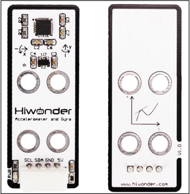
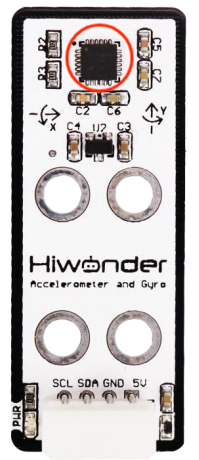
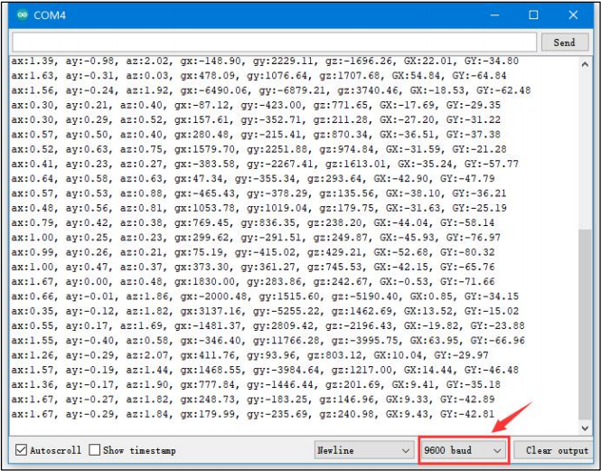

# 1. Acceleration Sensor Manual

## 1.1 Acceleration Sensor Description

### 1.1.1 Acceleration Sensor Introduction

The acceleration sensor is widely applicable for making devices such as handheld gaming controllers, 3D remote controllers, portable navigation systems, and similar equipment.

### 1.1.2 Working Principle

It primarily uses the MPU6050 component. It also integrates a 3-axis MEMS gyroscope, a 3-axis MEMS accelerometer, and an expandable Digital Motion Processor (DMP).

The acceleration features three 16-bit ADCs for both the gyroscope and accelerometer to convert measured analog signals into digital outputs. For precise tracking of fast and slow motion, its measurement range is adjustable.  
The gyroscope supports ±250/±500/±1000/±2000°/s (dps), and the accelerometer supports ±2/±4/±8/±16g.

## 1.2 Notice

1.  Do not exceed the rated voltage range during use.

2.  Handle with care during use.

## 1.3 Specifications

For more information, you may refer to "**[Acceleration sensor schematic](https://drive.google.com/drive/folders/11G1T_FoHvsdh_nTi8ZD0nIVgW8VKaKOu?usp=sharing)**"

### 1.3.1 Pin Instruction

| **Pin** | **Instruction** |
| :-----: | :-------------: |
|   5V    |   Power Input   |
|   GND   |     Ground      |
|   SDA   |       SDA       |
|   SCL   |       SCL       |

### 1.3.2 Specifications

<table  class="docutils-nobg" style="margin:0 auto" border="1">
<colgroup>
<col style="width: 50%" />
<col style="width: 50%" />
</colgroup>
<tbody>
<tr>
<td colspan="2" style="text-align: center;">

<strong>AccelerationSensor</strong>

</td>
</tr>
<tr>
<td style="text-align: center;">

<strong>Parameter</strong>

</td>
<td style="text-align: center;">

<strong>Specification</strong>

</td>
</tr>
<tr>
<td style="text-align: center;">

<strong>Power Supply</strong>

</td>
<td style="text-align: center;">

<strong>DC 5V</strong>

</td>
</tr>
<tr>
<td style="text-align: center;">

<strong>Data Interface</strong>

</td>
<td style="text-align: center;">

<strong>I2C bus with a maximum clock frequency of 400 kHz</strong>

</td>
</tr>
<tr>
<td style="text-align: center;">

<strong>Connector Type</strong>

</td>
<td style="text-align: center;">

<strong>5264-4AW</strong>

</td>
</tr>
<tr>
<td style="text-align: center;">

<strong>Measurement Range</strong>

</td>
<td style="text-align: center;">

<strong>±2，±4，±8，±16g</strong>

</td>
</tr>
<tr>
<td style="text-align: center;">

<strong>Indicator Light (PWR) Description</strong>

</td>
<td style="text-align: center;">

<strong>The PWR LED lights up when powered.</strong>

</td>
</tr>
<tr>
<td style="text-align: center;">

<strong>Product Dimensions</strong>

</td>
<td style="text-align: center;">

<strong>50mmx20mm</strong>

</td>
</tr>
<tr>
<td colspan="2" style="text-align: center;">

<strong>Modular installation, compatible with Lego series.</strong>

</td>
</tr>
</tbody>
</table>

## 1.4 Project Outcome

You can refer to the case tutorials and programs for different platforms in the same directory as this tutorial. This section will demonstrate the testing effect using Arduino IDE as an example.

The MPU6050 sensor measures acceleration along three axes, converts the analog values into digital data, and outputs them via the IIC bus. When the device is rotated, the acceleration value changes on the corresponding axis and is shown on the serial monitor.

