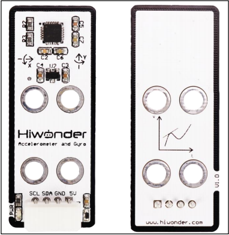
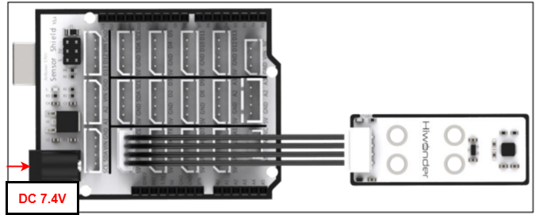
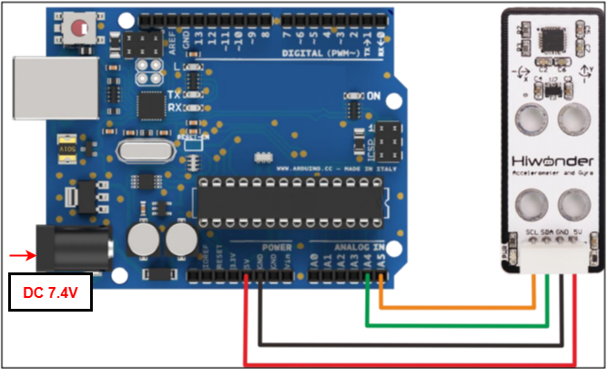
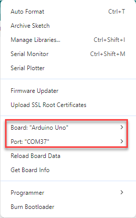
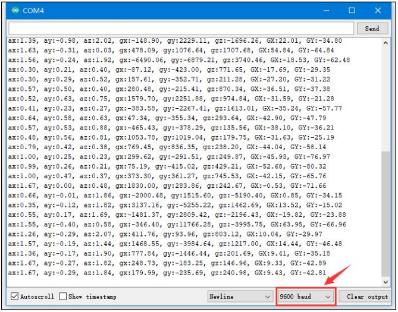

# 2. Arduino Development



## 2.1 Getting Started

### 2.1.1 Wiring Instruction

This section illustrates connecting a 4-pin cable to the SDA and SCL ports on the Arduino expansion board. Refer to the diagram below.



If you do not have an Arduino expansion board, use a Dupont wire to directly connect to the Arduino development board, just as below:



> [!NOTE]
>
> * When using Hiwonder's lithium battery, connect the battery cable with the red wire to the positive (+) terminal and the black wire to the negative (–) terminal of the DC port.
>
> * If the battery is not connected to the cables, do not connect the cable ends directly together. Doing so may cause a short circuit and damage the system.
>
> * Before powering on, ensure that no metal objects are touching the controller. Otherwise, the exposed pins at the bottom of the board may cause a short circuit and damage the controller.

### 2.1.2 Environment Configuration

You can install the Arduino IDE on a PC. Download path: "**[Appendix→ Arduino Installation Package.](https://drive.google.com/drive/folders/17M8AyV75WQptWOKvpO0UW3ITDHpaFf3x?usp=sharing)**" For more information, please refer to the relevant tutorials.

## 2.2 Test Case

Program to display the values detected by the accelerometer sensor in the terminal window.

### 2.2.1 Program Download

1. For the Arduino and UNO development board equipped with the expansion board, use a USB cable to connect them to the computer. You can open Arduino IDE, click "**File → NewFile → New**," and import the program located in the same directory as this tutorial.

2. Remember to select the correct development board and port. The ports shown below are for reference only. Then compile and upload the program.

   

3. After the code is uploaded, click  to open the serial monitor, set the baud rate to 9600 to observe the output.

### 2.2.2 Project Outcome

The data on the serial monitor change continuously when the accelerometer is adjusted manually. Along the sensor's X, Y, and Z axes, ax, ay, and az represent multiples of gravitational acceleration; gx, gy, and gz represent angular velocity; and GX and GY represent tilt angles along the X and Y axes.



### 2.2.3 Program Brief Analysis

**1. Import Libraries**

```py
#include <MPU6050.h> //Include the MPU6050 library
#include <I2Cdev.h> //Include the I2C communication library
```

**2. Define variables**

```py
MPU6050 accelgyro;

int16_t ax, ay, az; //Get 3-axis acceleration values from the sensor

int16_t gx, gy, gz; //Get the sensor's 3-axis tilt angles

float ax0, ay0, az0; //Store filtered acceleration values

float gx0, gy0, gz0; //Store filtered tilt angles

float ax1, ay1, az1; //Store calibrated acceleration values

float gx1, gy1, gz1; //Store calibrated angular velocity values

float dx;

float dx;

/* Store deviation values of tilt angles and acceleration */

int ax_offset, ay_offset, az_offset, gx_offset, gy_offset, gz_offset;

float radianY; //Record tilt angle along the X axis

float radianY; //Record tilt angle along the Y axis

float radianZ; //Record tilt angle along the z axis

float radianX_last; //Final X-axis tilt angle

float radianY_last; //Final Y-axis tilt angle
```

Define the variables required for calculations.

**3. Update tilt sensor data**

```py
void update_mpu6050()
{
  static uint32_t timer_u;
  if (timer_u < millis())
  {
    // put your main code here, to run repeatedly:
    timer_u = millis() + 20;
    accelgyro.getMotion6(&ax, &ay, &az, &gx, &gy, &gz);

    ax0 = ((float)(ax)) * 0.3 + ax0 * 0.7;  //Apply filtering to the read values
    ay0 = ((float)(ay)) * 0.3 + ay0 * 0.7;
    az0 = ((float)(az)) * 0.3 + az0 * 0.7;
    ax1 = (ax0 - ax_offset) /  8192.0;  //  Calibrate and convert to g-force multiples
    ay1 = (ay0 - ay_offset) /  8192.0;
    az1 = (az0 - az_offset) /  8192.0;

    gx0 = ((float)(gx)) * 0.3 + gx0 * 0.7;//Filter the read angular velocity values
    gy0 = ((float)(gy)) * 0.3 + gy0 * 0.7;
    gz0 = ((float)(gz)) * 0.3 + gz0 * 0.7;
    gx1 = (gx0 - gx_offset);  //Calibrate angular velocity
    gy1 = (gy0 - gy_offset);
    gz1 = (gz0 - gz_offset);

    // Compute X-axis tilt angle using complementary filter
    radianX = atan2(ay1, az1);
    radianX = radianX * 180.0 / 3.1415926;
    float radian_temp = (float)(gx1) / 16.4 * 0.02;
    radianX_last = 0.8 * (radianX_last + radian_temp) + (-radianX) * 0.2;

    // Compute Y-xis tilt angle using complementary filter
    radianY = atan2(ax1, az1);
    radianY = radianY * 180.0 / 3.1415926;
    radian_temp = (float)(gy1) / 16.4 * 0.01;
    radianY_last = 0.8 * (radianY_last + radian_temp) + (-radianY) * 0.2;
  }
}
```

**4. Print data**

```py
void print_data()
{
  static uint32_t timer_p;
  static uint32_t timer_printlog;
  if (timer_u < millis())
  {
    Serial.print("ax:"); Serial.print(ax1);
    Serial.print(", ay:"); Serial.print(ay1);
    Serial.print(", az:"); Serial.print(az1);
    Serial.print(", gx:"); Serial.print(gx1);
    Serial.print(", gy:"); Serial.print(gy1);
    Serial.print(", gz:"); Serial.print(gz1);
    Serial.print(", GX:"); Serial.print(radianX_last);
    Serial.print(", GY:"); Serial.print(radianY_last);
    timer_p = millis() + 500;
  }
}
```

**5. Serial Port Initialization**

```py
void setup()
{
  Serial.begin(9600);
  
  //MPU6050 Configuration
  Wire.begin();
  accelgyro.initialize();
  accelgyro.setFullScaleGyroRange(3); //Set the full-scale gyroscope range
  accelgyro.setFullScaleAccelRange(1); //Set the full-scale accelerometer  range
  delay(200);
  accelgyro.getMotion6(&ax, &ay, &az, &gx, &gy, &gz);  //Obtain current axis data for calibration
  ax_offset = ax;  //Calibrated X-axis acceleration data
  ay_offset = ay;  //Calibrated Y-axis acceleration data
  az_offset = az - 8192;  //Calibrated Z-axis acceleration data
  gx_offset = gx; // X-axis calibrated angular velocity data
  gy_offset = gy; // Y-axis calibrated angular velocity data
  gz_offset = gz; // Z-axis calibrated angular velocity data

  delay(1500);
}
```

**6. Loop Process**

```py
void setup()
{
  update_mpu6050:
  print_data();
  delay(500);
}
```