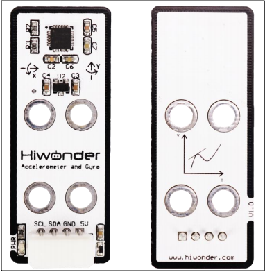
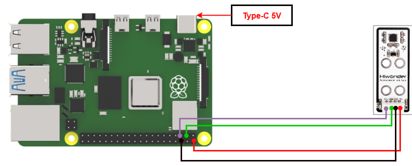

# 3. Raspberry Pi Development Tutorial

## 3.1 Getting Started

### 3.1.1 Wiring Instruction

Connect the accelerometer's 5V, GND, SDA, and SCL pins to the corresponding pins on the Raspberry Pi when wiring.

> [!NOTE]
>
> * When using Hiwonder's lithium battery, connect the battery cable with the red wire to the positive (+) terminal and the black wire to the negative (–) terminal of the DC port.
>
> * If the battery is not connected to the cables, do not connect the cable ends directly together. Doing so may cause a short circuit and damage the system.
>
> * Before powering on, ensure that no metal objects are touching the controller. Otherwise, the exposed pins at the bottom of the board may cause a short circuit and damage the controller.

### 3.1.2 Environment Configuration

Install NoMachine software on PC. You can find it under "**[Appendix -> Remote Connection Software](https://drive.google.com/drive/folders/1vAcJhnu8ZXBmEnPtpl-M5sYrCZ7iH3GQ?usp=sharing)**". For the detailed operations of NoMachine, please refer to the same directory.

Drag the program and SDK library files into the Raspberry Pi system image, the drag-and-drop action here is for illustration only. 

> [!NOTE]
>
> **Make sure the library files are placed in the same directory as the program.**

Open the terminal and enter the command to change to the program directory: **sudo chmod a+x Sensor_Demo/**.

## 3.2 Test Case

Program to display the values detected by the accelerometer in the terminal window.

### 3.2.1 Program Download

1. Open a new terminal and enter the following command to navigate to the program directory:

"**cd Desktop/Sensor_Demo/**" and press Enter.

2. Run the program by entering:

"**python3 AccelateReadDemo.py** ".

### 3.2.2 Project Outcome

You can adjust its orientation to test the three-axis angular velocity and acceleration, which can be viewed in the terminal.

### 3.2.3 Program Brief Analysis

* **Import Libraries**

Imported the required libraries: `smbus`, `math`, and `time`. The `smbus` library is used for IIC communication, `math` provides functions for mathematical operations, and `time` supSplies time-related functions.

* **Serial Port Initialization**

After importing the libraries, set the IIC bus No. to 1 and the MPU6050 address to 0x68. Configure the registers to read the X-axis acceleration and control the sensor's power mode and clock.

Then initialize the IIC bus through the `smbus.SMBus(I2C_BUS)` function to facilitate subsequent reading of sensor data.

Start the MPU6050 using `bus.write_byte_data(MPU6050_ADDR, MPU6050_PWR_MGMT_1, 0)`.

* **Register Address Data Reading**

Read the high 8 bits of a register using `high = bus.read_byte_data(MPU6050_ADDR, reg)`, then read the low 8 bits using `low = bus.read_byte_data(MPU6050_ADDR, reg)`.

Combine the two bytes and return the resulting value.

* **Sensor Data Reading**

Call the read_word function, use MPU6050_ACCEL_XOUT_H as the register address, and return the obtained value to accel_x, which corresponds to the data of the acceleration sensor x-axis.

The contents of accel_y, accel_z, gyro_x, gyro_y, and gyro_z are similar to accel_x, representing the data of the y-axis and z-axis of the acceleration sensor and the xyz-axis of the gyroscope sensor, respectively.

* **Main Function**

Call the `read_sensor_data` function to obtain the data of the sensor acceleration and gyroscope three axes, and assign them to six variables.

Divide the obtained data by the corresponding constant to reassign the values after converting units.

Print out the converted data and keep the last two decimal places.